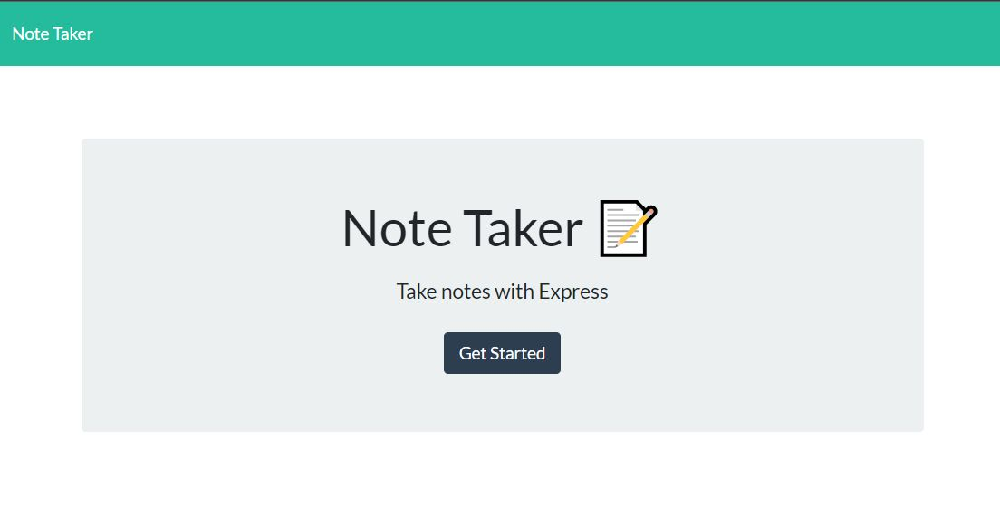
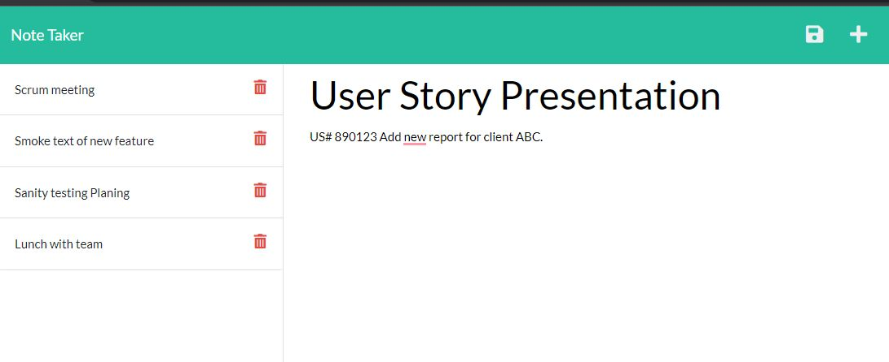

# Note-Taker

## table of Contents

* [Description](#Description)
* [Technology](#Technology)
* [Live Application](#Live%20Application)
* [Screenshots](#Screenshots)
* [License](#License)

## Description

This is a Note-Taker application that allows the user to input, save, and delete a note. The note must contain a title and text in order for the note to be saved. To write a new note, simply click the add icon in the upper right corner of the application.

When a new note is created, it will generate on the far left pane of the application with the list on notes. To see what was written in previous notes, simply click on the note itself. Lastly, to delete a specific note within the application, click the red garbage can icon. When the user clicks on the "Note Taker" text in the upper left corner of the application, it will take them to the "Get Started" home page.

## Technology

* JavaScript
* Node.js
* Express.js
* HTML
* CSS
* Bootstrap
* Heroku

## Live Application

[Application deployment to the HEROKU](https://radiant-bayou-98121.herokuapp.com/)

## Screenshots

## License

Permission is hereby granted, free of charge, to any person obtaining a copy of this Software and associated documentation files (the "Software"), to deal in the Software without restriction, including without limitation the rights to use, copy, modify, merge, publish distribute, sublicense, and/or sell copies of the Software, and to permit persons to whom the Software is furnished to do so, subject to the following conditions.

[View the full license](https://github.com/SerhiyZv/Note-Taker/blob/main/LICENSE)
